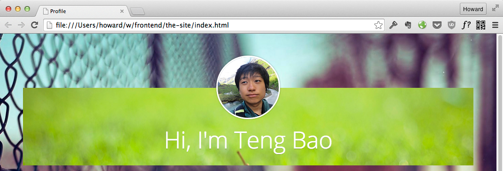
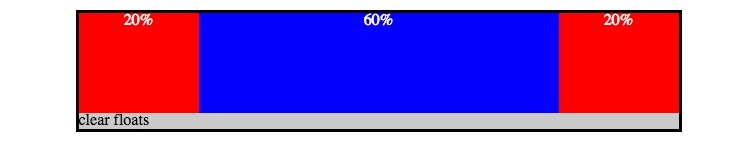
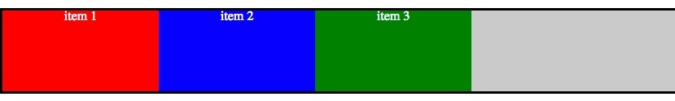
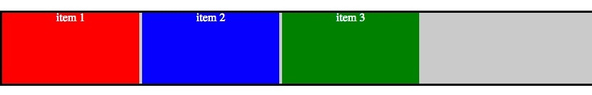

# learncss--小结
#### 导语:
> [index.html](index.html) 是一个以480px与960px为分界,使用 ** @media ** 查询来根据不同的页面宽度进行不同的样式设置,以达到响应式效果的页面,并大量使用了HTML5标签.只响应宽度小于480px和宽度大于960px的屏幕.

## css小技能

在本页面实现过程中有几个布局技巧是很少见但使用起来得心应手的样式属性;

1. 折叠间距的解决

    如果容器和它的子元素都设有margin-top,那么容器本身的margin-top会和第一个子元素的margin-top折叠在一起,导致第一个子元素设置的margin不管用,此时解决办法是给其父元素一个padding为0;这样就可以给元素设置需要的margin值了.
    > 效果图说明 
    > 头像设置 margin:-70;
    > 设置 padding:0; 之前 
    > 设置 padding:0; 之后 

2. display:inline-block; 布局和 float 布局的区别

    对元素设置display:inline-block;元素会对外表现为行元素,对内表现为块元素,所以自身占据一定空间,而设置float的元素自身是不占用空间的,所以这时其父元素是获取不到其高度的,需要设置overflow:hidden;属性来获取所有内容的高度.
    > 效果图说明
    子元素设置了 float 其父元素的表现 
    > 
    父元素设置了 overflow:hidden; 之后 
    > 
    子元素设置了 display:inline-block; 和子元素设置了float:left; 父元素设置了 overflow:hidden; 的元素展示效果 
    > 

3. :after 设置伪类元素来撑开容器高度以及设置标题下划线等功能

    对于子元素设置了浮动等不占用实际空间的容器,是获取不到实际的高度的,这时可以在容器的内部加一个空的伪类元素,来撑起容器的高度.

    > ```<div class="clearfic"></div>```
    > .clearfix:after{ content:""; display:table; clear:both; }

    对于标题的下滑线我们除了加一条 ```<hr>``` 实线之外,我们还可以采用伪类元素来进行处理.

4. 使用转义字符进行标题断行

    对于标题字体过大或过长移动端小屏不能一行显示的标题,让其自动断行的标题会比较不美观,一般采用转义字符来进行强行断行.

    > 效果图说明
    自动换行的标题 
    > 
    加入转义字符并进行强制换行的标题 
    > 

    > ```<div class="break">EDUCATION <span>&amp;</span> EXPRIENCE</div>```
    > .break{ word-break:break-all; }


